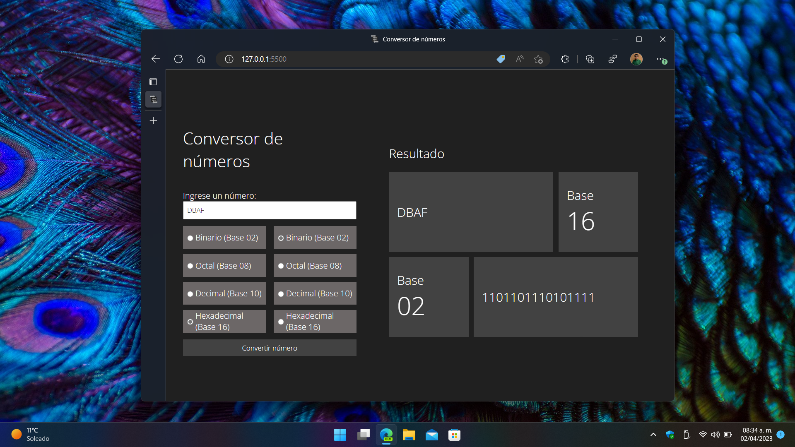

# Calculator Suite

## Conversor de sistemas númericos

Esta herramienta permite tomar una cantidad expresada ya sea en sistema binario, octal, decimal o hexadecimal y convertirla a cualquiera de los sistemas númericos previamente mencionados.

### Características

- Soporte para cantidades expresadas en sistema binario (Base exponencial 2)
- Soporte para cantidades expresadas en sistema octal (Base exponencial 8)
- Soporte para cantidades expresadas en sistema decimal (Base exponencial 10)
- Soporte para cantidades expresadas en sistema hexadecimal (Base exponencial 16)
- Soporte multiplataforma
- Diseño responsivo
- Modo obscuro
- Modo sin conexión para Windows y Android (No disponible por el momento)

## Requisitos de compilación

- Powershell Desktop (Versión 5.1 o superior)
- Node.js (Versión 18.4.2 LTS o superior)
- Node Package Manager (Versión 9.5.0 o superior)
- Typescript Compiler (Versión 5.0.2 o superior)
- Browserify (Versión 17.0.0 o superior)

